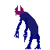
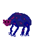
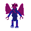

# TimeLost

Данный проект является результатом работы в рамках дисциалины "ООП"
на кафедре "МО ЭВМ" университета СПбГЭТУ "ЛЭТИ" им. В.И.Ульянова (Ленина)

# Архитектура проекта

* В папке _include_ находятся заголовочные файлы
* В папке _src_ находятся исходники
* В папке _lib_ находятся скомпилированные библиотеки
* В папке _tests_ находятся unittest'ы
* В папке _game_ находится графический интерфейс для игры
* В папке _resources_ находится ресурсы необходимые для игры

# Компиляция

Для изменения компилятора изменить значение ```$(CC)``` в файле
```Header.mk```. __Компилятор должен поддерживать 17-ый стандарт языка
C++__. Для изменения флагов компиляции изменить значение ```$(CFLAGS)```
 в файле ```Header.mk```.

* Для компиляция библиотек необходимо выполнить команду ```make``` 
или ```make libs```
* Для запуска тестов необходимо выполнить команду ```make run_tests```
* Для компиляции игры с графическим интерфейсом необходимо 
выполнить команду ```make game```
* Если компиляция нужна без debug информации, то все выше перечисленный
команды выполнять с аргументом ```COMPILE_TYPE=Release```
* Для удаления временных файлов выполнить команду ```make clean```
* Для библиотек выполнить команду ```make clean_libs```

При выполнении ```make game``` в корневой директории проекта появится
файл игры: _TimeLost_

# Графический интерфейс

## Управление

* W - передвинуться вверх. В меню: выбрать элемент выше
* S - передвинуться вниз. В меню: выбрать элемент ниже
* A - передвинуться вправо
* D - передвинуться влево
* E - Подобрать предмет. В меню: выполнить выбранный элемент
* Enter - атаковать. Атака происходит по всем врагам, которые находятся 
на расстоянии меньше одной клетки(диагональные не учитываются)

## Предметы

* Меч 
* Монетка 
* Зелье здоровья 

## Поле

* Заблокированная клетка 
* Свободная клетка 
* Вход 
* Выход 

## Персонажи

* Игрок 
* Враги:
    * 
    * 
    * 
